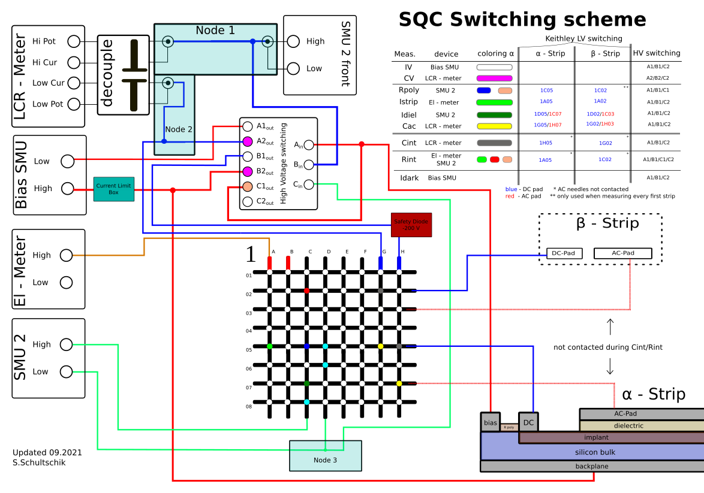

# SQC

Sensor Quality Control for the CMS Tracker



## Install

Install SQC from from GitHub.

```bash
pip install git+https://github.com/hephy-dd/sqc.git@main
```

## Run SQC

```bash
python -m sqc
```

## Run Emulators

Run comet socket instrument emulators specified in `emulators.yaml` file.

```bash
python -m comet.emulators -f emulators.yaml
```
